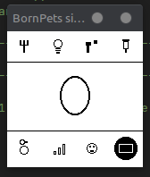

# BornHack CyberÆgg Badge Firmware

Embassy-based async firmware for the BornHack CyberÆgg badge (nRF52840).

## Hardware

| Component  | Part              | Interface      |
|------------|-------------------|----------------|
| MCU        | nRF52840          | —              |
| Display    | SSD1675 e-paper   | SPI3           |
| LoRa radio | SX1262            | SPI2           |
| BLE        | nRF52840 built-in | nrf-sdc / MPSL |

## Architecture

The firmware runs three concurrent Embassy tasks:

- **BLE task** — GATT peripheral exposing Nordic UART Service (NUS). Speaks the MeshCore companion protocol; handles all commands from the companion app and pushes async notifications.
- **MeshCore task** — drives the SX1262 in continuous RX. Receives/transmits MeshCore packets (adverts, private messages, channel messages, trace-path, login). Forwards received packets to the BLE task via channels.
- **Display task** — renders UI screens to the SSD1675 e-paper display.

### Bootloader

`embassy-boot-nrf` replaces the factory Adafruit UF2 bootloader.  
The `bootloader/` directory is a standalone Cargo project (not in the workspace, not tracked in git).

Flash partition layout:

| Region         | Start        | End          | Size  |
|----------------|--------------|--------------|-------|
| Bootloader     | `0x00000000` | `0x0000BFFF` | 48 K  |
| State          | `0x0000C000` | `0x0000CFFF` | 4 K   |
| Active (app)   | `0x0000D000` | `0x00084FFF` | 480 K |
| DFU            | `0x00085000` | `0x000FEFFF` | 480 K |

The main app's `memory.x` sets `FLASH ORIGIN = 0x0000D000`.

### Vendor libraries

| Library              | Location            | Notes                                                     |
|----------------------|---------------------|-----------------------------------------------------------|
| `meshcore`           | `vendor/meshcore/`  | MeshCore packet codec (no_std)                            |
| `meshcore-companion` | `vendor/meshcore-companion/` | BLE companion protocol encoder/decoder          |
| `ssd1675`            | `vendor/ssd1675/`   | Async Embassy SSD1675 driver with OTP LUT readback, variant detection (A/B), `UpdateMode`, `BorderWaveform`, fast LUT |

## Connecting with MeshCore

The badge is compatible with the MeshCore companion app, available for Android/iOS and as a web app.

When the badge boots, it begins advertising over BLE. On first pairing a numeric passkey is shown on the e-paper display — enter this in the app to complete the bond.

Once connected, the MeshCore app gives full control of the LoRa mesh side of the firmware:

- View and message contacts discovered over LoRa
- Send and receive channel messages
- Manage stored contacts and routing paths
- Adjust radio parameters (frequency, bandwidth, spreading factor, TX power)
- Run path traces (ping) to nearby nodes
- Monitor incoming advertisements and ACKs in real time

The badge appears in the app as a standard MeshCore node. All mesh activity (received messages, adverts, ACKs) is pushed to the app as BLE notifications without polling.

## MeshCore Companion Protocol

The firmware implements the [MeshCore companion protocol](https://docs.meshcore.io/companion_protocol/) over BLE NUS.

### Commands handled (companion → device)

| Code   | Name                | Description                                    |
|--------|---------------------|------------------------------------------------|
| `0x01` | `APP_START`         | Returns `SELF_INFO`                            |
| `0x02` | `SEND_TXT_MSG`      | Send private message to contact                |
| `0x03` | `SEND_CHANNEL_MSG`  | Send message to a channel                      |
| `0x04` | `GET_CONTACTS`      | Stream all contacts (`CONTACT_START/.../END`)  |
| `0x06` | `SET_DEVICE_TIME`   | Set RTC clock                                  |
| `0x07` | `SEND_SELF_ADVERT`  | Flood or zero-hop self-advertisement           |
| `0x08` | `SET_ADVERT_NAME`   | Set advertised node name                       |
| `0x09` | `ADD_UPDATE_CONTACT`| Add or update a contact                        |
| `0x0A` | `SYNC_NEXT_MESSAGE` | Dequeue next pending message                   |
| `0x0B` | `SET_RADIO_PARAMS`  | Change LoRa frequency/BW/SF/CR                 |
| `0x0C` | `SET_RADIO_TX_POWER`| Change TX power                                |
| `0x0D` | `RESET_PATH`        | Clear routing path for a contact (set to flood)|
| `0x0E` | `SET_ADVERT_LATLON` | Set advertised GPS position                    |
| `0x0F` | `REMOVE_CONTACT`    | Delete a contact                               |
| `0x13` | `REBOOT`            | Reboot device                                  |
| `0x14` | `GET_BATT_AND_STORAGE` | Returns battery voltage and storage stats   |
| `0x16` | `DEVICE_QUERY`      | Returns `DEVICE_INFO`                          |
| `0x1A` | `SEND_LOGIN`        | Login to a room/repeater server                |
| `0x1E` | `GET_CONTACT_BY_KEY`| Fetch full contact record by public key        |
| `0x1F` | `GET_CHANNEL`       | Fetch stored channel name and key              |
| `0x20` | `SET_CHANNEL`       | Store a channel name and key                   |
| `0x24` | `SEND_TRACE_PATH`   | Send trace packet (ping); returns `0x89` async |
| `0x26` | `SET_OTHER_PARAMS`  | Set telemetry mode, location policy, etc.      |
| `0x2A` | `GET_ADVERT_PATH`   | Return last-seen advert path for a contact     |
| `0x36` | `SET_FLOOD_SCOPE`   | Set or clear transport-key flood scope         |

### Push notifications (device → companion)

| Code   | Name                 | Trigger                                         |
|--------|----------------------|-------------------------------------------------|
| `0x80` | `ADVERTISEMENT`      | Node advert received over LoRa                  |
| `0x82` | `ACK`                | Message ACK received                            |
| `0x83` | `MESSAGES_WAITING`   | Incoming message queued                         |
| `0x85` | `LOGIN_SUCCESS`      | Login accepted by remote node                   |
| `0x86` | `LOGIN_FAIL`         | Login rejected                                  |
| `0x88` | `LOG_RX_DATA`        | Raw received packet log                         |
| `0x89` | `TRACE_DATA`         | Trace-path result (response to `0x24`)          |
| `0x8A` | `NEW_ADVERT`         | Newly discovered or updated contact             |

## Setup

Clone with submodules:

```bash
git clone --recursive <your-repo-url>
```

Install the Rust embedded target:

```bash
rustup target add thumbv7em-none-eabihf
```

## Build

### Simulator

The simulator requires SDL2:

```bash
# Debian / Ubuntu
sudo apt install libsdl2-dev

# Fedora
sudo dnf install SDL2-devel

# Arch Linux
sudo pacman -S sdl2

# macOS
brew install sdl2
```

Build and run:

```bash
make sim
```



The simulator renders the full badge UI in a desktop window using SDL2, mirroring the SSD1675 e-paper layout and icon grid.

#### Key bindings

| Key        | Badge button     | Action                              |
|------------|------------------|-------------------------------------|
| Arrow keys | Joystick         | Navigate menus and icon grid        |
| Space      | Joystick fire    | Fire / select highlighted item      |
| Enter      | Execute button   | Execute / confirm action            |
| Backspace  | Cancel button    | Cancel / close modal                |
| Escape     | —                | Quit simulator                      |

### Firmware (nRF52840)

```bash
make fw
```

### Flash firmware

```bash
make flash
```

### Debug (VS Code + probe-rs)

Open the project in VS Code and press **F5**. The `cargo fw` build runs automatically before flashing.

### Other targets

| Command              | Description                              |
|----------------------|------------------------------------------|
| `make fw-release`    | Release build                            |
| `make flash-release` | Flash release build                      |
| `make monitor`       | Attach RTT log monitor (app)             |
| `make bl`            | Build bootloader                         |
| `make bl-flash`      | Full-chip erase + flash bootloader       |
| `make dfu-flash`     | Flash app over USB DFU                   |

## Python balance simulator

See [`simulation_py/README.md`](simulation_py/README.md) for the Bornpets game balance simulator.
